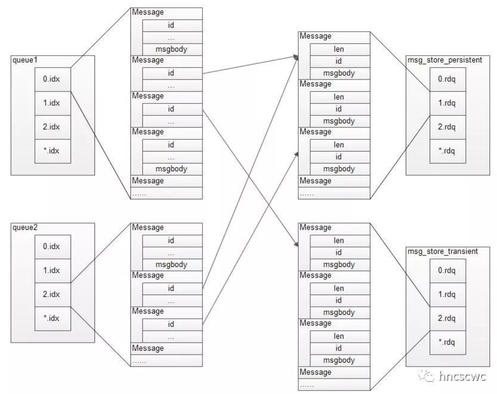

# What is the purpose of this tool

rabbitmq-storage-recovery does everything possible (or almost) to recover messages that could have been lost during a rabbit outage. There are several important files that will store the rabbit messages that have been published in a queue. Index files with suffix .idx and message_store files with suffix .rdq. (for more details read the documentation below). It is therefore on these files that the work of extracting the messages is done.

# Pre requisites

**rust** installation:
```
curl --proto '=https' --tlsv1.2 -sSf https://sh.rustup.rs | sh
```

**pyrlang-term** package installation:
```
$ git clone https://github.com/Pyrlang/Term.git
$ pip install -e .
```

# Usage

```
$ python3 main.py
Usage: main.py [OPTIONS] COMMAND [ARGS]...

Options:
  --install-completion  Install completion for the current shell.
  --show-completion     Show completion for the current shell, to copy it or
                        customize the installation.

  --help                Show this message and exit.

Commands:
  recover-idx-file          Command to extract unacked messages from a...
  recover-indexes           Command to extract all unacked messages stored...
  recover-persistent-store  Command to extract all messages from a RabbitMQ...
  recover-rdq-file          Command to extract messages from a specific
                            .rdq...
```

# Storage persistence

First, some background: both persistent and transient messages can be written to disk. Persistent messages will be written to disk as soon as they reach the queue, while transient messages will be written to disk only so that they can be evicted from memory while under memory pressure. Persistent messages are also kept in memory when possible and only evicted from memory under memory pressure. The "persistence layer" refers to the mechanism used to store messages of both types to disk.

The persistence layer has two components: the queue index and the message store. The queue index is responsible for maintaining knowledge about where a given message is in a queue, along with whether it has been delivered and acknowledged. There is therefore one queue index per queue.

The message store is a key-value store for messages, shared among all queues in the server. Messages (the body, and any metadata fields: properties and/or headers) can either be stored directly in the queue index, or written to the message store.

The intent is for very small messages to be stored in the queue index as an optimisation, and for all other messages to be written to the message store. This is controlled by the configuration item 'queue_index_embed_msgs_below'. By default, messages with a serialised size of 'less than 4096 bytes' (including properties and headers) are stored in the queue index.


